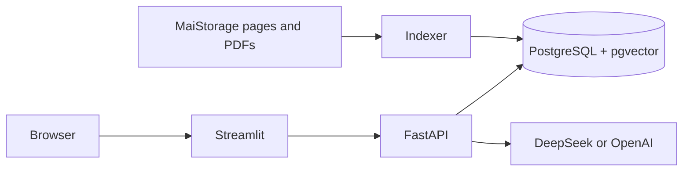

A FastAPI and Streamlit application for streaming LLM chat, MaiStorage product lookup, technical-document search and aiDAPTIV+ environment checks.

The chat streams responses from DeepSeek or OpenAI through server-sent events (SSE). PostgreSQL stores completed messages and restores the conversation after a browser refresh. The product tools use structured data and a versioned RAG corpus built from approved public MaiStorage sources.


## Features

- Real provider-delta streaming through FastAPI and SSE
- DeepSeek and OpenAI provider selection
- PostgreSQL conversation memory
- Conversation restoration through a session UUID
- Product catalogue, filtering and comparison
- aiDAPTIV+ environment validation
- Hybrid document retrieval with citations
- Source registry and evaluation dashboard
- Docker Compose deployment
- Automated API, database, retrieval and UI tests

## Architecture



The streaming chat uses `POST /api/v1/chat/stream`. The MaiStorage RAG system uses `POST /api/v1/chat`.

## Technology

| Component | Technology |

| API | FastAPI and Uvicorn |
| Frontend | Streamlit |
| Database | PostgreSQL 17 and pgvector |
| LLM providers | DeepSeek and OpenAI |
| Agent workflow | LangGraph |
| Embeddings | BGE Small through FastEmbed |
| Ingestion | Scrapy and pypdf |
| Deployment | Docker Compose |
| Tests | Python unittest and Streamlit AppTest |

## Quick start

### Requirements

- Docker Desktop
- A DeepSeek or OpenAI API key for live chat

### 1. Configure the environment

```powershell
Copy-Item .env.example .env
notepad .env
```

Add your provider keys to `.env`:

```dotenv
OPENAI_API_KEY=
OPENAI_MODEL=gpt-5-mini
DEEPSEEK_API_KEY=
DEEPSEEK_MODEL=deepseek-v4-flash
```

### 2. Start the application

```powershell
docker compose up -d db
docker compose --profile tools run --rm index
docker compose up --build -d api ui
docker compose ps
```

Open:

- Application: <http://127.0.0.1:8501>
- Swagger API: <http://127.0.0.1:8000/docs>
- Health check: <http://127.0.0.1:8000/health/ready>

The repository includes processed source snapshots, so the first index does not require a live website crawl.

## Streaming example

```powershell
$session = [guid]::NewGuid().ToString()
$body = @{
  session_id = $session
  message = "Explain server-sent events in two sentences."
  provider = "deepseek"
} | ConvertTo-Json -Compress

curl.exe -N `
  -H "Accept: text/event-stream" `
  -H "Content-Type: application/json" `
  -d $body `
  http://127.0.0.1:8000/api/v1/chat/stream
```

The endpoint returns `meta`, `token` and `done` events. The server saves the user and assistant messages after the provider completes the response.

## API endpoints

| Method and path | Purpose |
|---|---|
| `GET /health/live` | API liveness |
| `GET /health/ready` | Database and corpus readiness |
| `POST /api/v1/chat/stream` | Streaming LLM chat |
| `GET /api/v1/chat/{session_id}` | Conversation history |
| `POST /api/v1/chat` | MaiStorage RAG chat |
| `GET /api/v1/products` | Product catalogue |
| `POST /api/v1/products/compare` | Product comparison |
| `POST /api/v1/products/search` | Product search |
| `POST /api/v1/aidaptiv/validate-environment` | Environment validation |
| `GET /api/v1/sources` | Approved source registry |
| `GET /api/v1/evaluations/latest` | Latest evaluation result |
| `GET /api/v1/runs/{run_id}` | RAG trace and evidence |

## Tests

Run the complete test suite:

```powershell
docker compose exec -T api python -m unittest discover -s tests -v
```

Run the RAG evaluation:

```powershell
docker compose exec -T api python -m evaluations.run
```

Run the live provider benchmark after configuring API keys:

```powershell
python -m evaluations.run_q2_live --provider both
```

Current checked-in results:

- Automated tests: 28 of 28 passed
- RAG evaluation: 65 of 65 passed on the versioned test set

Live provider latency and quality depend on the configured account, model and network.

## Project structure

```text
app/                 API, streaming chat, Streamlit UI and RAG workflow
data/processed/      Parsed public-source snapshots
evaluations/         Evaluation data and runners
ingestion/           Approved-source crawler
tests/               Automated test suite
.github/workflows/   Continuous verification
compose.yaml         Docker services
schema.sql           Database schema
```

## Docker commands

```powershell
# View service status
docker compose ps

# View API logs
docker compose logs -f api

# Restart the API
docker compose restart api

# Rebuild the API and UI
docker compose up --build -d --force-recreate api ui

# Stop the application and keep database data
docker compose down
```

## Security

- Keep API keys in `.env`.
- Do not commit `.env`, logs, raw downloads or screenshots.
- The browser sends only the provider name, session UUID and message.
- The API validates inputs and removes provider details from error responses.
- Failed or interrupted streams do not create partial conversation records.
- Docker binds local services to `127.0.0.1`.

Add authentication, rate limits, managed secrets, TLS and retention policies before a public production deployment.

## Data sources

The crawler accepts approved public MaiStorage pages and PDFs. `data/source_registry.json` records source URLs, hashes and retrieval times. `data/last_run.json` records the latest crawl result.

Review the source terms and licence requirements before publishing extracted content in a public repository.
